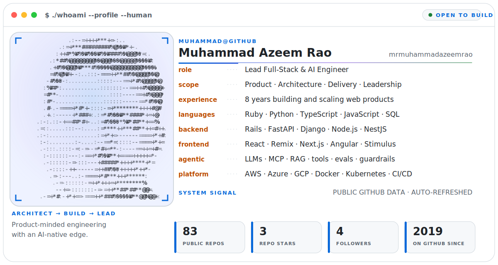

<a href="https://github.com/mrmuhammadazeemrao">
  <picture>
    <source media="(prefers-color-scheme: dark)" srcset="./assets/profile-console-dark.svg">
    
  </picture>
</a>

<p align="center">
  <a href="https://www.linkedin.com/in/mrmuhammadazeemrao/"></a>
  <a href="https://medium.com/@mrmuhammadazeemrao"></a>
  <a href="https://stackoverflow.com/users/13865966/mrmuhammadazeemrao"></a>
  <a href="mailto:mrmuhammadazeemrao@gmail.com"></a>
</p>

## Hello, I'm Muhammad Azeem Rao

I'm a **Lead Full-Stack & AI Engineer**, **product-minded architect**, and hands-on engineering leader with around **8 years of experience** turning ambiguous business problems into dependable software products.

My strongest work sits where product, architecture, and execution meet: shaping a pragmatic technical direction, building the critical path, reducing delivery risk, and helping the people around me do their best work. I bring a **principal-engineer mindset** without losing touch with the code.

Today, I'm especially focused on **AI-native product engineering**: LLM applications, agentic workflows, AI agents, retrieval, tool use, evaluation, and human oversight—combined with the full-stack and cloud foundations needed to ship them reliably.

## What I build

- **AI-native products** — LLM applications, agent orchestration, RAG, tool/function calling, structured outputs, MCP integrations, evals, tracing, guardrails, and human-in-the-loop workflows.
- **Scalable platforms** — modular backends, REST and GraphQL APIs, service-oriented systems, data-intensive workflows, performance tuning, and cloud-native delivery.
- **Polished web experiences** — accessible, responsive interfaces built with modern React ecosystems and backed by thoughtful product decisions.
- **High-leverage engineering teams** — architecture direction, technical strategy, stakeholder alignment, code review, mentoring, and delivery ownership.

## Evidence over buzzwords

| 10+ large-scale applications | 30%+ performance improvement | 99.9% service uptime |
|:---:|:---:|:---:|
| **Hours → minutes** for deployments | **500+ automated tests** maintained | **15+ engineers** mentored |

I have led end-to-end product development, optimized APIs and databases, reduced cloud costs by thousands of dollars per month, automated CI/CD release paths, and helped teams improve both delivery speed and code quality.

## Technology map

| Area | Technologies and capabilities |
|---|---|
| **AI & agentic systems** | LLM applications, agentic AI, AI agents, multi-agent orchestration, RAG, embeddings and vector retrieval, tool/function calling, structured outputs, MCP, prompt engineering, context engineering, evals, tracing and observability, guardrails, human-in-the-loop, LLMOps |
| **Agentic development** | Claude Code, OpenAI Codex, AI-assisted architecture, repository-scale reasoning, autonomous implementation loops, test-driven agent workflows, code review with AI |
| **Languages** | Ruby, Python, TypeScript, JavaScript, SQL, HTML, CSS |
| **Backend** | Ruby on Rails, FastAPI, Django, Flask, Node.js, NestJS, GraphQL, REST APIs, background processing, service-oriented architecture |
| **Frontend** | React (React.js), Remix (Remix.js), Next.js, Angular, Stimulus, Redux, Tailwind CSS, responsive UI, accessibility |
| **Cloud & platform** | AWS, Azure, Google Cloud, Docker, Kubernetes, serverless, CI/CD, GitHub Actions, Jenkins, AWS CodePipeline, cloud cost optimization, observability |
| **Data** | PostgreSQL, MySQL, MariaDB, SQLite, MongoDB, Firebase, Elasticsearch, data modeling, query and database performance tuning |
| **Quality & delivery** | RSpec, PyTest, automated testing, API testing, code review, SonarQube, RuboCop, ESLint, secure delivery, release automation |
| **Architecture & leadership** | System design, API design, scalability, reliability, resilience, technical strategy, product thinking, stakeholder collaboration, mentoring |

## How I approach engineering

```text
Understand the outcome → make trade-offs explicit → design the smallest sound system
→ ship in observable increments → measure reality → improve continuously
```

- **Product before platform:** architecture exists to create customer and business value.
- **Simple before clever:** complexity needs to earn its place.
- **Reliability is a feature:** testing, observability, security, and operability begin at design time.
- **AI needs evidence:** agentic systems deserve evals, guardrails, traces, and human control—not just impressive demos.
- **Leadership is leverage:** clear decisions, useful feedback, and strong engineers compound over time.

## Current focus

- Building production-grade AI agents and LLM-powered product workflows.
- Deepening multi-agent orchestration and interoperability with **MCP** and **A2A** patterns.
- Using agentic coding systems such as **Claude Code** and **OpenAI Codex** for faster, verifiable delivery.
- Designing backend platforms with **Python / FastAPI / Django** and **Node.js / NestJS**.
- Shipping modern product experiences with **React.js / Remix.js / Next.js**.
- Growing toward broader **Principal Engineer / Software Architect** scope while staying hands-on.

## Beyond the code

I enjoy mentoring engineers, running code reviews and mock interviews, sharing practical lessons, and helping people navigate their careers. If you're working on an ambitious product, modernizing a platform, or exploring how agentic AI can create real value, I'd be glad to connect.

<p align="center">
  <strong>Let's build software that is useful, resilient, and ready for what comes next.</strong><br>
  <a href="mailto:mrmuhammadazeemrao@gmail.com">Email</a> ·
  <a href="https://www.linkedin.com/in/mrmuhammadazeemrao/">LinkedIn</a> ·
  <a href="https://medium.com/@mrmuhammadazeemrao">Writing</a>
</p>
